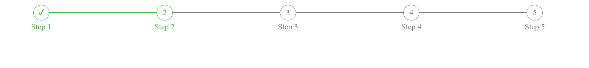

# Horizontal Progress bar

Simple progressbar in HTML and CSS only.



## Usage

The class `completed-step` marks the step as completed with a check. `current-step` highlights the current step and displays the number. `next-step` will be grayed out and will have numbers on them.

HTML structure of the counters

```html
    <tr class="counter">
        <td class="progress-item completed-step">
            <div></div>
        </td>
        <td class="progress-item current-step">
            <div></div>
            <span></span>
        </td>
        <td class="progress-item next-step">
            <div></div>
            <span></span>
        </td>
        <td class="progress-item next-step">
            <div></div>
            <span></span>
        </td>
        <td class="progress-item next-step">
            <div></div>
            <span></span>
        </td>
    </tr>
```

The descriptions are displayed at the bottom

```html
    <tr class="descriptions">
        <td class="completed-step">Step 1</td>
        <td class="current-step">Step 2</td>
        <td class="next-step">Step 3</td>
        <td class="next-step">Step 4</td>
        <td class="next-step">Step 5</td>
    </tr>
```

Numbering is done automatically in css using counter-increment

```css
    .progress-item{
        counter-increment: list;
    }
    .progress-item.next-step div::after{
        content: counter(list);
    }
    .progress-item.current-step div::after{
        content: counter(list);
    }
```

### Result

Screenshot below shows the resulting UI


### Todo

Pending Improvements

1. [ ] Add javascript animations
2. [ ] Tracking of process stages using php/javascript